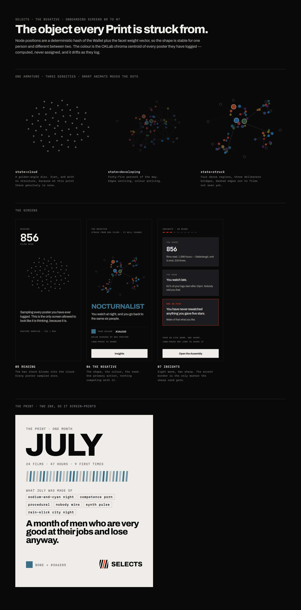

# The Negative

The object every Print is struck from.



---

## 1. The name

`DIRECTION.md` §13 already locks a ladder of artifacts — **the Print**, **the Cut**, **the
Year** — and every one of them is *struck from* something. That something had no name.

**The Negative** is it. Your taste as a single object, in a colour computed from everything you
have watched, with the shape of your own graph.

The name does three jobs at once:

- It sits under names already locked instead of competing with them. A print comes from a
  negative; that relationship is the product's, not a metaphor bolted on.
- It earns the unique colour honestly. A negative is where colour is inverted and particular to
  the stock — so "your colour" is a property of the object rather than a decoration.
- It survives being said out loud by someone who is not a cinephile, which the alternates did
  not: **the Emulsion** is the most technically accurate and the hardest to say, and **the Answer
  Print** is two words and one of them is chatty.

**It is not the Assembly.** The Assembly stays the explorable graph you travel by dot and edge.
The Negative is the portrait struck from it — one frame, no navigation, made to be looked at and
shown. Same data, two objects, and the distinction is the same one the app already makes between
Rabbit Hole and the Assembly: motion versus rest.

---

## 2. Your colour is computed, not assigned

The single most-copied thing in this category is a randomly assigned "personality colour." This
is the opposite of that.

**Your colour is the chroma centroid of every poster you have logged.**

1. Sample each logged film's poster once at import. `extractDominantColor` already does this at
   `src/lib/orbitEngine.ts:367-409`, currently to wash a single Orbit background.
2. Average in **OKLab**, not RGB. Averaging in RGB pulls every set of colours toward brown, which
   would give every user the same mud. OKLab averages perceptually, so a user of blue crime films
   and a user of warm westerns land somewhere genuinely different.
3. **Pin lightness** into a band that stays legible on `#0A0A0B`. The colour is never allowed to
   be so dark it disappears or so light it competes with `--fg`.
4. **Floor the chroma.** A user with genuinely scattered taste would average to grey, which reads
   as a bug rather than a fact. Below the floor, chroma is scaled up to the floor and the
   Negative says so in words — *struck from a wide range* — instead of showing a grey blob.

`DECISIONS.md` §13 already flags dominant-poster-colour across a library as novel, computable and
cheap if done once at import. This is that, specified.

**It drifts.** Recomputed on a rolling window, so a year of horror moves your colour and you can
watch it happen. That is the whole reason the artifact is worth re-opening: it is never final.

---

## 3. The shape

Node positions come from a **deterministic hash of the Wallet plus the facet weight vector**, so
the shape is reproducible for a given user and different for every user. Re-running it never
reshuffles someone's identity.

Rendering follows §8 exactly, because this is the same graph:

- Seen films are solid and carry their own poster colour. Unseen are outlined and colourless.
- Edge weight is shared-facet rarity. `0.87` is never shown to anyone.
- The Wallet anchors the centre.

What is new here is **density as the message.** The reference is the dot cloud in Apple's
device-to-device migration, with one difference that matters: that cloud is decorative and
uniform, and this one has structure. Where you are dense, it is dense. Someone who logs 800 films
across four directors gets a tight knot; someone who logs 200 across everything gets a wide,
sparse field. Both are flattering in different ways, and neither is a score.

**Sparse is honest.** A user who skips the Letterboxd import still gets a Negative, struck from
their three to eight onboarding picks, and it says so: *struck from nine films — it will change.*
Faking density at that point would be the first lie the app tells.

---

## 4. The one-word read

One word, under the constellation.

**It is chosen by lift, not by volume.** The most common facet in a user's graph is almost always
the most common facet in everyone's graph, so counting would label half the userbase
`PROCEDURALIST`. The read is the cluster with the highest lift over the global baseline — what
makes this map *unusual*, not what makes it big. This is the same TF-IDF logic the mining
pipeline already uses in `VOCABULARY.md` §5.

Words name a territory:

| Read | Comes from |
|---|---|
| `NOCTURNALIST` | `world` / `look` — night, rain-slick, sodium |
| `PROCEDURALIST` | `tempo` — competence, method, process |
| `FORMALIST` | `camera` / `shape` — locked-off, unbroken, nonlinear |
| `REVIVALIST` | `format` — 70mm, 16mm, repertory, Academy ratio |
| `FATALIST` | `weather` — nobody wins, doomed, guilt as engine |
| `MINIATURIST` | `world` — one apartment, one room, one night |
| `COMPLETIST` | behaviour — finishes filmographies rather than sampling them |

Three rules govern the word, and they exist to keep it inside the voice:

1. **It names what the map is dense in, never a flaw in the person.** `DIRECTION.md` §11 rule 6
   says the app observes and never compliments, and Round 2 §4 says it comments on the map, not
   the person. `NOCTURNALIST` describes territory. *"You keep choosing men who lose"* is a
   verdict on someone's character delivered by a phone. The first is allowed here; the second is
   not allowed anywhere.
2. **It only appears where the user opened the door.** §7's 80/20 rule confines sharp reads to
   the import reveal and profile insights. The read lives on the Negative, which is both.
3. **If nothing clears the lift threshold, there is no word.** The screen says *not enough yet* and
   names what would fix it. A bland word would cost more trust than a blank space does.

---

## 5. The insight catalogue

`DECISIONS.md` §7 locks the ratio: **four in five reads are warm and useful, one in five is the
uncomfortable one.** Ten cards, eight warm, two sharp. Numbers below use the locked `856` example
from §13.

**Warm**

1. **The count.** `856 films.` Not "Imported."
2. **The equivalence.** `1,598 hours. Sátántangó, end to end, 218 times.` Absurd and true, per §13.
3. **The hour.** `61% of your logs start after 10pm.` You are a late watcher and nobody told you.
4. **The colour.** Your films average out to *this* — the colour itself, full bleed, named.
5. **The concentration.** `41 films. Six cinematographers.` Straight from `AUDIT.md` §4.8.
6. **The rating tell.** `Eleven films about brothers. You rated every one of them four or higher.`
7. **The season.** `You watch westerns in January. Only January.`
8. **The poster tell.** `Eleven of your last twenty had purple on the poster.` The founder's own
   example, and the best proof in the set that the app looked at the actual images.

**Sharp — one in five, and they only appear here**

9. **The contradiction.** `You have never rewatched anything you gave five stars.`
10. **The blind spot.** `You have never seen Dog Day Afternoon. Everything here says you should
    have.` This is the card that makes the next session inevitable, and it is the founder's own
    example from §27.

Every card is individually shareable, because a single observation travels further than a
collage. Per §22 there are no per-platform buttons — one image, one long-press, the OS sheet.

---

## 6. Where it sits

```
04 Letterboxd → 05 Reading → 06 The Negative → 07 Insights → the Assembly
```

- **05 Reading.** The compressed bar stack from the onboarding armature explodes into the cloud.
  Carries the count. This is the only screen in the app allowed to look like it is thinking,
  because it genuinely is.
- **06 The Negative.** The constellation, the colour, the read, and one primary action. §13 is
  explicit that nothing competes with it.
- **07 Insights.** The card walk. Ends by handing off to the Assembly.

After onboarding it lives on the profile, which is where §7 already permits sharp reads, and it
is what a **Print** is rendered from each month.

---

## 7. Motion

One new token. Everything else reuses `DIRECTION.md` §10.

| Token | Value | Use |
|---|---|---|
| `develop` | 1400ms · `cubic-bezier(.16,1,.3,1)` · 8ms stagger per node | the cloud resolving into the constellation |

The name is the process: a negative is exposed, then developed. Idle drift reuses `drift`
(8s linear ∞), which §10 already assigns to Assembly idle. Traversal into a node from an insight
card reuses `arc`. Nothing new is needed because the Negative is the Assembly holding still.

**Figma cannot keyframe this.** The plugin API exposes Smart Animate between frames and nothing
else, so the Figma build shows three density states and tweens position between them. The
staggered per-node develop is specified here for whoever builds it in code.

---

## 8. What it must never do

- **No score.** No 0–100, no rank, no percentile, no "taste level." Focus is the only number in
  the product and it measures the app's confidence, not the user's worth.
- **No comparison on the artifact.** Match percentage lives on someone else's profile per §23, not
  on your own Negative. The moment your identity object shows you a ranking it stops being yours.
- **No flattery.** §11 rule 6. The read observes. It does not congratulate.
- **No grey blob and no fake density.** Both are covered above, and both are cases where the
  honest version is also the better-looking one.
