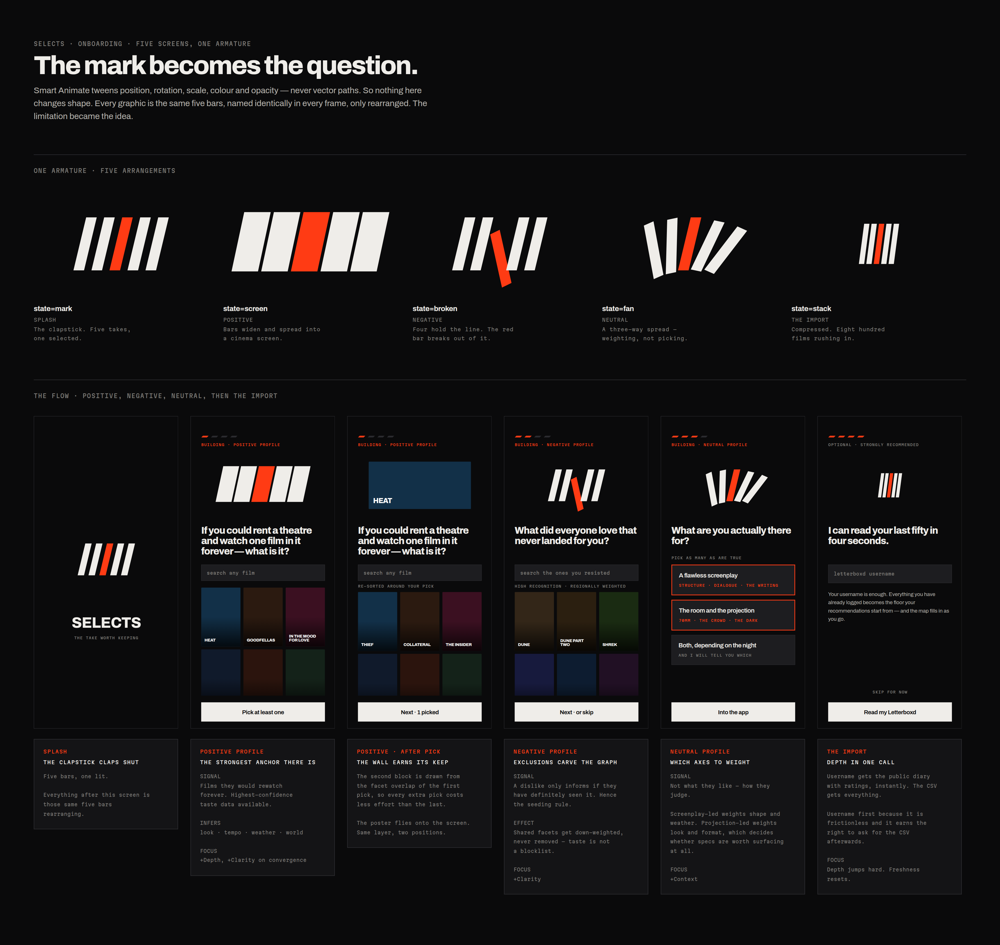

# Onboarding — eight screens, one armature

Built on the `03 Onboarding` page of the
[Selects Design](https://www.figma.com/design/s5r0lZNKa9d92r2W5z6akU/Selects-Design) file, wired
as a clickable Smart Animate prototype starting at `00 Splash`.

Five screens ask the questions; three more hand back what the answers bought. Those last three are
specified in **[NEGATIVE.md](NEGATIVE.md)** and summarised in section 6 below.



---

## The constraint that shaped the whole thing

You asked for the questions to morph into each other. Figma's Smart Animate tweens **position,
rotation, scale, colour and opacity**. It does not tween vector paths. So a graphic cannot melt
into an unrelated shape — no amount of prototyping settings will do it.

The way out is to stop treating the graphics as different shapes.

Every morphing graphic in the flow is the **same five bars**, named `bar-1` through `bar-5`,
present in every frame, only rearranged. Smart Animate matches them by name and moves them.
That turns a technical limitation into the strongest idea in the flow: **onboarding is the logo
assembling and reassembling itself**, and the user watches the mark become each question.

| Screen | Arrangement | What it draws |
|---|---|---|
| `00 Splash` | `mark` | The clapstick. Five takes, one selected. |
| `01 Your theatre` | `screen` | Bars widen and spread into a cinema screen. |
| `02 Everyone but you` | `broken` | Four bone bars hold the line; the red bar breaks out of it. |
| `03 What you go for` | `fan` | The bars fan into a spread — weighting, not picking. |
| `04 Letterboxd` | `stack` | The bars compress into a dense inbound stack. |
| `05 Reading` | — | The stack blooms out and the bars become a 64-dot cloud. |

`02` is the one worth pointing at. The question is *what did everyone love that never landed for
you?* — and the graphic is four bars in formation with one breaking ranks. The question is drawn,
not illustrated.

The armature is a single component set, `Morph armature`, on `02 Components`. Change a bar there
and every screen updates.

---

## The screens

### 00 Splash

Mark, wordmark, one line: **THE TAKE WORTH KEEPING**.

The five bars clap shut into the mark and settle. Everything after this is those same bars.

### 01 Your theatre — positive profile

> If you could rent a theatre and watch one film in it forever — what is it?

Cinema screen at the top, search below it, then the wall. Multi-select. Two states are built side
by side so the interaction is unambiguous:

- **seeded** — the opening wall
- **after first pick** — the chosen plate has flown up onto the cinema screen and the wall has
  re-sorted to films adjacent to that pick

The re-sort is the part that matters. Picking *Heat* replaces the generic wall with *Thief*,
*Collateral*, *The Insider*, *Manhunter*, *Sicario*. Every additional pick costs the user less
effort than the last one, which is how you get more than one answer out of a first-run screen.

**What it buys the model.** The highest-confidence taste data that exists — films they would
rewatch forever. These seed the Wallet directly. Infers `look`, `tempo`, `weather`, `world`.
Moves Focus: **+Depth**, and **+Clarity** if the picks converge on shared facets.

### 02 Everyone but you — negative profile

> What did everyone love that never landed for you?

Seeding rule, annotated on the board: **high recognition, regionally weighted, nothing obscure**.
A negative signal is worth nothing unless they have definitely seen the film — so the opening
block is the *Dune* / *Shrek* / *La La Land* / *Titanic* tier, with regional blockbusters seeded
by geography (`3 Idiots`, `RRR` in the Indian cut). Never a film they might not recognise.

**What it buys the model.** Exclusions carve the graph rather than filling it. Facets shared
across their dislikes get **down-weighted, never removed** — taste is not a blocklist. Moves
Focus: **+Clarity**.

### 03 What you go for — neutral profile

> What are you actually there for?

Three multi-select cards:

- **A flawless screenplay** — structure, dialogue, the writing
- **The room and the projection** — 70mm, the crowd, the dark
- **Both, depending on the night** — and I will tell you which

**What it buys the model.** Not what they like — *how they judge*. Screenplay-led answers weight
`shape` and `weather`. Projection-led answers weight `look` and `format`, which is also what
decides whether technical specs are worth surfacing to this user at all. Moves Focus:
**+Context**.

### 04 Letterboxd — skippable

> I can read your last fifty in four seconds.

Username field, one primary action, an explicit `SKIP FOR NOW`. Recommended, never required.

Username first because it is frictionless, and because it earns the right to ask for the CSV
afterwards — once they already believe you. Username gets the public diary with ratings
instantly; the CSV gets everything.

**What it buys the model.** Depth jumps hard in one call. Freshness resets.

---

## 6. The payoff — 05 to 07

Five screens of questions with nothing handed back is a form. These three are the reason the
questions were worth answering, and they are specified in full in **[NEGATIVE.md](NEGATIVE.md)**.


**05 Reading.** The compressed bar stack blooms out and becomes a 64-dot cloud on a golden-angle
spiral — even, and with no structure, because at this point there genuinely is none. Carries
`856 films read`. The only screen in the app allowed to look like it is thinking.

**06 The Negative.** The cloud resolves into their constellation, in a colour computed from every
poster they have logged, under a one-word read. One primary action.

**07 Insights.** Ten cards, eight warm and two sharp, each shareable alone.

The cloud is a single component with three density states — `cloud`, `developing`, `struck` — and
64 nodes named `n-00` to `n-63` in all three, so the same trick that morphs the bars resolves the
constellation. `05 → 06` runs on a 1.4s custom bezier rather than the spring, because developing
a negative is slower than a screen transition and should feel like it.

---

## Prototype

Each screen carries one `ON_CLICK` reaction to the next, `SMART_ANIMATE` with Figma's `GENTLE`
spring, matching the `settle` token in [DIRECTION.md](DIRECTION.md) section 10 — except `05 → 06`,
which uses the `develop` token. The flow starting point is set, so presentation mode opens on the
splash and the morph plays on every advance.

```
00 Splash → 01 Your theatre → 01 after first pick → 02 Everyone but you → 03 What you go for
          → 04 Letterboxd → 05 Reading → 06 The Negative → 07 Insights → the Assembly
```

---

## Known limits

**Poster art is typographic.** `api.themoviedb.org` and `image.tmdb.org` are both outside this
environment's network allowlist, so the film wall is built from typographic plates in the
system's own language. The `Film tile` fill is bound to `Film/dominant`, so real artwork drops
into the same layout with no redesign. Allowlist the two domains and the swap is mechanical.

**No true timeline animation.** Figma's plugin API exposes no keyframe creation — only Smart
Animate between frames. The full motion intent, including the bar-by-bar stagger on the splash
clap, stays documented in [DIRECTION.md](DIRECTION.md) section 10 for whoever builds it in code.

---

## File structure

The file was flattened from ten pages to four while this was built:

| Page | Holds |
|---|---|
| `00 Cover` | unchanged |
| `01 System` | the eight documentation sections, one board, three columns |
| `02 Components` | every component set, laid out as a library with usage rules |
| `03 Onboarding` | this flow, plus an annotation panel under each screen |

Nothing is duplicated. The one-pager's Components section shows representative *instances* and
points at `02 Components` for the full variant matrix, so there is exactly one source of truth
per component.
