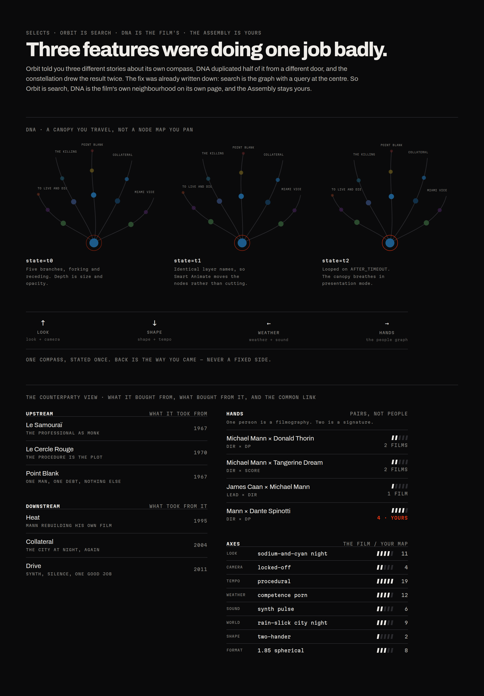

# Orbit, DNA, and where the graph lives

---

## 1. The problem, stated honestly

Three features in the app do overlapping versions of the same thing, and none of them wins.

- **Orbit** (`/orbit/:id`) — swipe a card in four directions to travel between films, with a
  constellation view behind a pinch.
- **DNA** (`/dna/:id`) — traverse film → person → film through TMDB credits, as a breadcrumb grid.
- **The Orbit constellation** — the trail of where you have been, drawn.

Worse, Orbit tells you three different stories about its own compass. The engine in
`src/lib/orbitEngine.ts` uses `visual` / `balanced` / `storytelling` / `emotional`. The drag
overlays in `OrbitCardStack.tsx` say Vibe / Back / Auteur / Aesthetic. The onboarding in
`OrbitControls.tsx` calls it "The Cinephile Compass" and describes a fourth arrangement. The hint
at the bottom says *"swipe right to go back"* even when back is a different direction entirely.

That is why it never felt finished. It was not an unfinished feature — it was three features
wearing the same coat.

---

## 2. The resolution: Orbit is what search is

`DIRECTION.md` §8 already wrote this down without noticing it had answered the question:

> **Search is the Assembly with a query at the centre.** Typing a title doesn't return a list, it
> drops you into the graph at that film with its neighbours around you, swipeable in any
> direction. Same renderer, different entry point — not a separate build.

That is Orbit. So Orbit is not a mode you enter from a film page. **Orbit is the search surface**,
and it takes the nav slot that search would have taken.

This is the load-bearing change. Everything else falls out of it.

| Name | What it is | Whose it is |
|---|---|---|
| **Orbit** | the search surface. A query drops you into the web and you travel it | the catalogue's |
| **DNA** | a section on the film page. The film's own neighbourhood, dense and factual | the film's |
| **The Assembly** | every film *you* have logged, laid out | yours |
| **Rabbit Hole** | what a long Orbit session becomes, and it pays out on the way out | a session state |

The test that makes it memorable: **DNA is the film's, the Assembly is yours, Orbit is the verb.**

---

## 3. The compass, settled

One source of truth, drawn from the eight-axis vocabulary already locked in `DIRECTION.md` §7,
plus the collaborator graph — which is how DNA's person-traversal survives without needing its own
screen.

| Direction | Reads | Axes behind it |
|---|---|---|
| **↑ LOOK** | shot like this | `look` + `camera` |
| **↓ SHAPE** | built like this | `shape` + `tempo` |
| **← WEATHER** | feels like this | `weather` + `sound` |
| **→ HANDS** | the same people | the collaborator graph |

**Back is the way you came**, labelled with where you came from, never pinned to a fixed side.
The current build already computes this correctly in `getBackDirection()` and then contradicts it
in the UI copy.

`/dna/:id` dies. Nothing is lost: its traversal is now `→ HANDS`, and its content is the DNA
section. That is consistent with `DECISIONS.md` §24 — nothing gets deleted, everything gets
promoted.

---

## 4. Hands: the unit is a pair, not a person

One person is a filmography. **Two is a signature**, and a signature is something you can actually
follow.

Damon × Affleck is six films and a specific thing — two friends writing themselves parts nobody
would have offered them. Damon × Soderbergh is five films and a completely different thing.
Sandler × Rock, Mann × Spinotti, Scorsese × De Niro. The pair carries information the individual
does not, and it branches: from a pair you can leave through either person into their other pairs.

This is also the answer to a question the current app cannot answer — *why* two films are
connected by people rather than merely *that* they are.

---

## 5. DNA: the Bloomberg counterparty view

Open a stock in a Bloomberg terminal and you see who it buys from and who it sells to, plus the
links it holds in common with everything around it. That maps onto film exactly:

- **UPSTREAM** — what this film took from. *Thief* ← *Le Samouraï*, *Le Cercle Rouge*, *Point Blank*.
- **DOWNSTREAM** — what took from it. *Thief* → *Heat*, *Collateral*, *Drive*.
- **HANDS** — the common link, as pairs, with counts.
- **AXES** — the film's genome on the left, **your own map's response on the right**.

That last column is the part worth defending. The eight axes are ground truth and identical for
everyone; the count beside each one is how many films in *your* library share that facet. Same
table, different reading per person. Objective and personal in one grid, which is what the
Spotify DNA screen gets right and what a generic "similar films" row never can.

Density is the point. Mono throughout, hairline rules, radius zero, real measurements only. No
similarity score is ever shown — `0.87` stays hidden, per §7. A terminal shows measurements, not
model output.

---

## 6. Travelling it: the canopy, not the node map

The graph should not be a flat field of dots you pan around. It is **a canopy you move through** —
branches that curve, fork, and recede, with depth carried by size and opacity. You grab a branch
and travel along it; the film you were standing on becomes the trunk behind you.

Built as three sway states with identical layer names, looped on `AFTER_TIMEOUT` with Smart
Animate. That is the only continuous motion Figma can hold, and it is enough to show that the
thing is alive rather than printed.

---

## 7. Rabbit Hole is a state, not a surface

`DECISIONS.md` §3 locks Rabbit Hole as the deep lane that *pays out* — every session ends by
handing you a recommendation that could only have come from that specific wander.

It does not need its own screen. It is what Orbit becomes after enough moves, and the payout lands
on the trail when you leave: *"Every film you touched tonight is downstream of this one, and you
have never logged it. That is the only reason it is here."*

Save a trail and it becomes a **room** — which is where `SavedVibesScreen` goes.

---

## 8. Navigation

The app currently has no tab bar. Watched, Watchlist and Saved Vibes are hidden behind an avatar
dropdown, and `/me` is routed but linked from nowhere.

Four destinations:

| Tab | Holds |
|---|---|
| **Home** | the Strip, the Ticket, the Nudge |
| **Orbit** | search, the web, Hands, trails |
| **Library** | Watched, the Wallet, Saved, Rooms, shared lists |
| **You** | the Negative, Focus, the Assembly, insights, the Print |

---

## 9. On Location

The film-tourism prototype on `add-selects-travel` is called *Selects — Film Locations*, and
`DECISIONS.md` §26 calls it *Selects Maps*. Both are descriptions rather than names.

**On Location** is what a call sheet says. It sits in the same register as the Print, the Cut and
the Strip — a real production term doing a product job — and it is the only one of the three you
would say out loud.

Redesigned surfaces: the proximity lock screen, the world as a dotted globe built from the same
dots as the Negative, the nearby feed, and the scene page. One rule added that the prototype does
not have: **only films already in your map surface here.** A location alert for a film you have
never heard of is spam; one for a film you logged in 2019 is a reason to cross the street.
