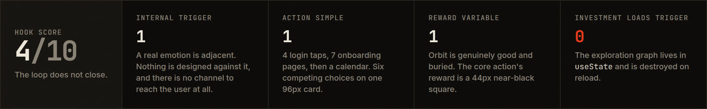
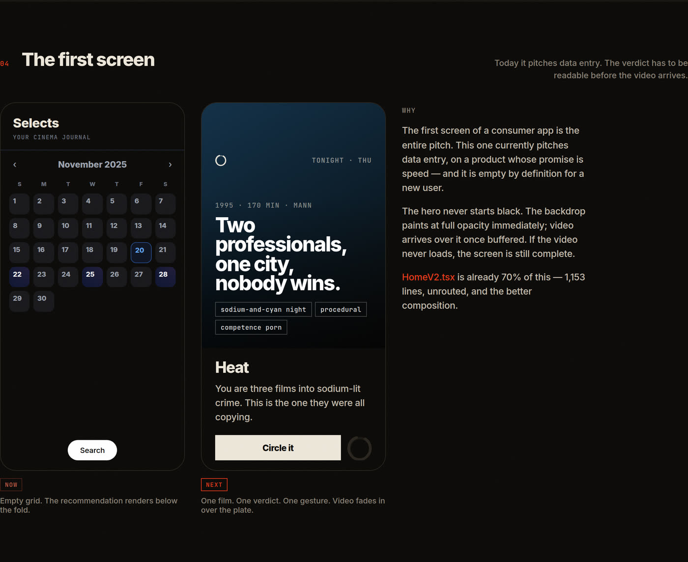
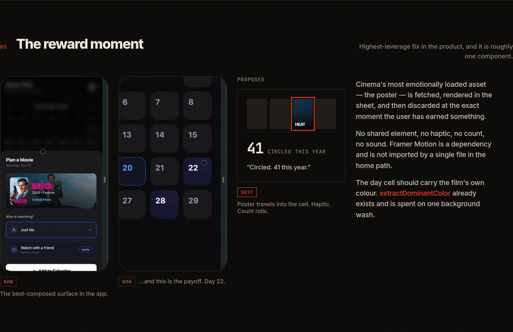
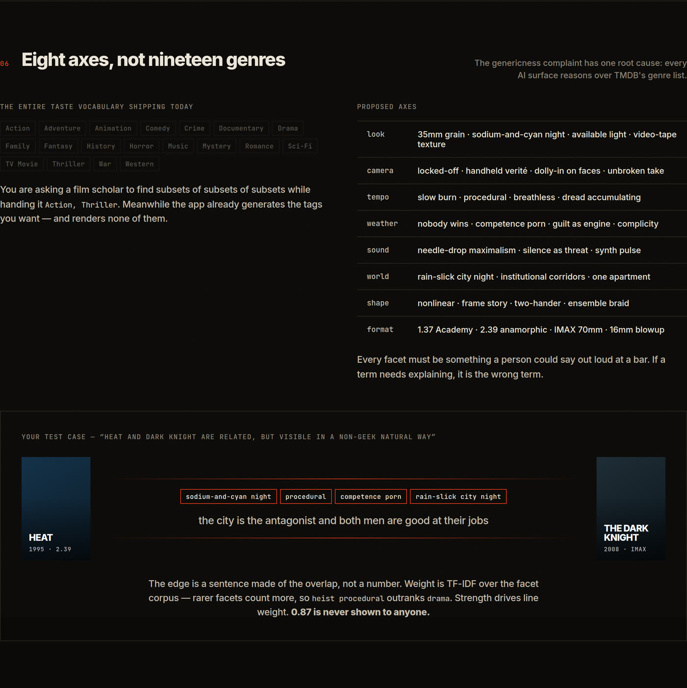
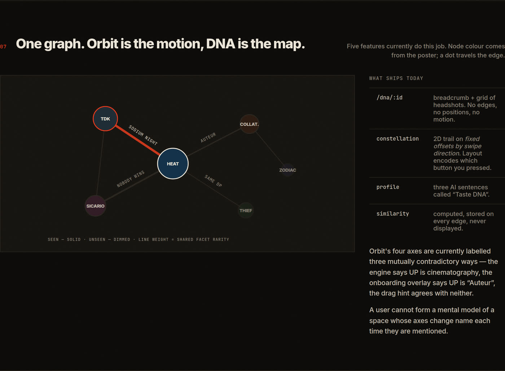
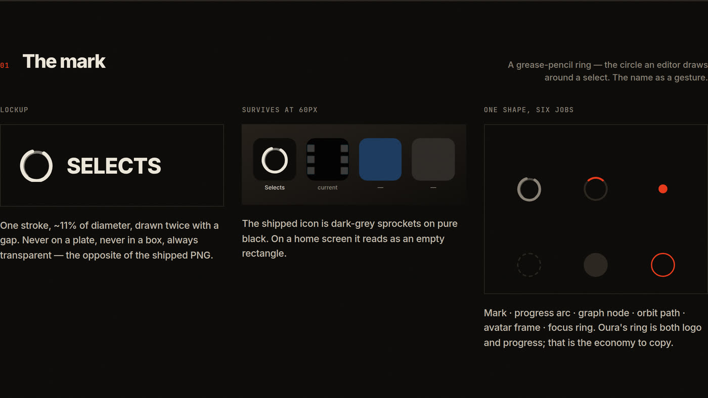
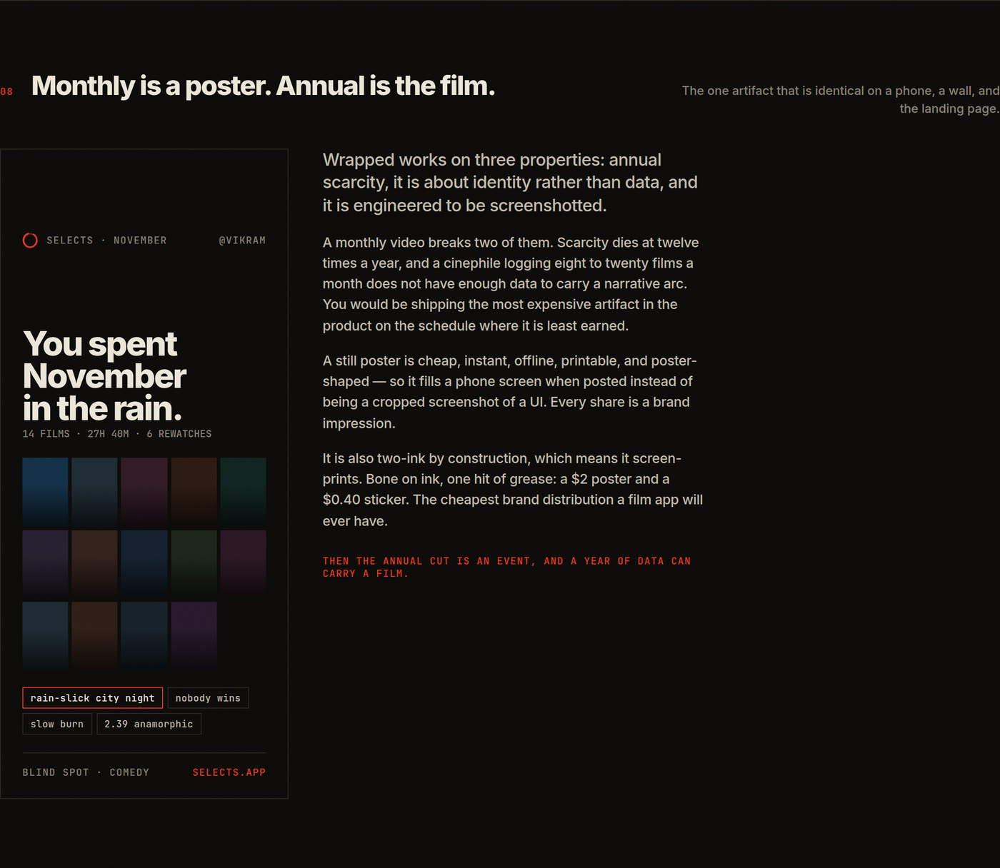
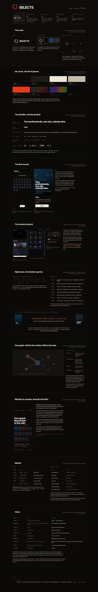

# Selects — Design Review

A full UI/UX audit of the app at commit `ba07af6`, plus a proposed brand, system and motion
direction, plus the questions I need answered before anything gets built.

| Document | What it is |
|---|---|
| **[AUDIT.md](AUDIT.md)** | The audit. Hook Model score, feature-by-feature teardown, a read of the vision back to you, and a 38-item defect register with `file:line` for every claim. |
| **[DIRECTION.md](DIRECTION.md)** | The proposal. Mark, colour, typography, voice, the eight-axis facet vocabulary, motion tokens, and how the brand crosses from phone to print to web. |
| **[QUESTIONS.md](QUESTIONS.md)** | 27 questions, 7 blocking. |
| **[direction-board.html](direction-board.html)** | The visual version. Open it in a browser — it is live HTML/CSS and meant to be edited, not a flat export. |

Nothing in the app has been changed. This is a review and a proposal; `QUESTIONS.md` exists
because several of the calls in `DIRECTION.md` are yours to make, not mine.

---

## The short version

**Hook Model score: 4/10 — the loop does not close.**

Five findings, in order of what they cost:

1. **The reward for the core action is an invisible dark blue square.** A user finds a film,
   taps *Add to Calendar*, and the payoff is a day cell turning a slightly different shade of
   near-black. The poster is fetched, shown in the sheet, then discarded at the exact moment
   the user has earned something.
2. **The app forgets you.** The exploration graph lives in React `useState` and is destroyed
   on reload. There is no push, no email, no widget, no streak, no recap anywhere in the
   repository — so nothing the user invests can ever bring them back.
3. **The genericness has one root cause, and it is 19 strings long.** Every AI surface in the
   product reasons over TMDB's genre list. Meanwhile the app already generates the specific
   micro-tags you want, and renders none of them.
4. **"Similar in terms of what?" — the answer is computed and thrown away.** Same for the
   personalised synopsis, the Reddit tags, and the chat's taste context. There is a
   personalisation layer in this codebase that users have never seen.
5. **The identity is literally invisible.** The app icon is dark-grey sprockets on pure black.
   The wordmark PNG has a black plate baked behind it. The product ships under three names at
   once.

---

## The first screen

Today it pitches data entry, on a product whose promise is speed — and it is empty by
definition for a new user.

## The reward moment

The highest-leverage fix in the product, and it is roughly one component.

## Eight axes, not nineteen genres

Your test case, answered: the Heat ↔ Dark Knight edge is a sentence made of shared facets,
not a number.

## One graph

Orbit is the motion, DNA is the map. Five features currently do this job, and Orbit's four
axes are labelled three mutually contradictory ways.

## The mark

A grease-pencil ring — the circle an editor draws around a select. The name as a gesture, and
a shape the product can reuse as a node, an orbit, a progress arc, and a focus ring.

## Monthly is a poster. Annual is the film.

My strongest disagreement with the brief, and the one artifact that is identical on a phone,
a wall, and the landing page.

---

## Everything, in one image

