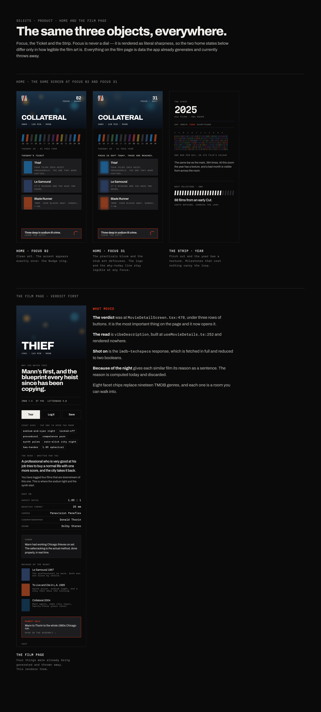

# Selects — Design Review

A full UI/UX audit of the app at `ba07af6`, your answers to all 36 questions across two rounds
converted into locked decisions, and the system that follows from them.

| Document | What it is |
|---|---|
| **[DECISIONS.md](DECISIONS.md)** | All 36 answers, locked, across both rounds. Where you overruled me, I say so. Read this first — it supersedes parts of the audit. |
| **[DIRECTION.md](DIRECTION.md)** | The system: mark, colour, type, voice, motion, and the two objects that close the loop. |
| **[VOCABULARY.md](VOCABULARY.md)** | The taste vocabulary — what Letterboxd's nanogenres actually are, where they're weak, and the mining pipeline that replaces hand-writing it. |
| **[AUDIT.md](AUDIT.md)** | The original audit. Hook Model score, feature teardown, and 38 defects with `file:line`. Findings stand; three recommendations are annotated as superseded. |
| **[ONBOARDING.md](ONBOARDING.md)** | The eight-screen onboarding flow: the morph armature, the copy, the wall seeding rules, and what each question buys the taste model. |
| **[NEGATIVE.md](NEGATIVE.md)** | The Negative — the taste artifact. The naming, the computed per-user colour, the one-word read, and the ten-card insight catalogue. |
| **[ORBIT.md](ORBIT.md)** | Where the graph lives. Orbit is search, DNA is the film's own counterparty view, the Assembly is yours, and Rabbit Hole is a session state. Also settles the compass and names On Location. |
| **[QUESTIONS.md](QUESTIONS.md)** | Round 2, now answered. |
| **[direction-board.html](direction-board.html)** | The visual version. Live HTML/CSS with the fonts self-hosted — open it and edit it. |
| **[onboarding-board.html](onboarding-board.html)** | The onboarding flow, live. Same tokens, same geometry as the Figma components. |
| **[negative-board.html](negative-board.html)** | The Negative, live. Runs the same seeded generator as the Figma component, so the shapes are identical. |
| **[product-board.html](product-board.html)** | Home and the film page, live, including both Focus states. |
| **[orbit-board.html](orbit-board.html)** | The DNA canopy and the counterparty tables, live. Same bezier geometry as the Figma component. |

---

## What changed

Six reversals across the two rounds, and each one made the design better.

---

## The mark

You were right about the ring: Criterion owns a circle, and a ring is not differentiating.
Your clapstick instinct is stronger — and it gave the system more than a logo.

**Six takes. One selected.** The name, drawn.

And unlike the ring, the bar is reusable. One shape, seven jobs — which means the
sprocket-detent date strip you asked for falls out of the logo instead of being designed
separately.

---

## Focus and the Ticket

Your readiness score, made honest. It doesn't measure whether *you* are ready — you always
are. It measures **how sharply Selects has you in focus**, and it **decays**.

That decay is the first thing in the product where investment loads the next trigger — the
Hook row that was scoring 0. And it's rendered as literal sharpness: the image is the metric.

The number is primary and drives the state, decay is gentle, and the stub carries four actions
— because tickets *will* surface films the user has already seen, and **Seen it** turns that
mistake into the lowest-friction logging surface in the product.

---

## 11:40pm

The mechanism was already in your data. The Ticket was torn at 9:15 and the runtime is 170
minutes, so the push fires at 12:10. No guessing — and it makes the torn stub the only feature
that tells you when someone is *inside* a film.

---

## Nanocrowd tags the film. We tag the edge.

Letterboxd's themes and nanogenres come from Nanocrowd — ~20,000 titles, three comma-separated
words, mined from audience reviews, identical for every user. Across every visible example,
**not one term describes craft**. That isn't sloppiness: audience reviews don't contain that
language, so a review-mining system can't produce it — which is why blending vernacular with
critics isn't a style preference but a data requirement.

---

## Two layers, and every facet is a room

The hybrid you asked for: one vocabulary that never drifts, phrased differently for every
user. Tap one facet and you're in a room; tap three and you're somewhere nobody else is.

---

## The Assembly

Rabbit Hole is the Assembly in motion; the Assembly is Rabbit Hole at rest. One graph, two
verbs — and nothing gets deleted to build it. Logging fills a node in, so your map visibly
grows.

---

## Named from the cutting room

Because the app already was. Your origin story gave the product its vocabulary, not just its
mark.

---

## Onboarding: the mark becomes the question

Smart Animate tweens position, rotation, scale, colour and opacity — never vector paths. So the
morph you asked for is impossible between unrelated shapes, and possible between **the same five
bars, rearranged**. The limitation became the idea: onboarding is the logo assembling itself into
each question.

The negative-profile screen is the one to look at. *What did everyone love that never landed for
you?* — and the graphic is four bars holding formation while the red one breaks out of line.

Full spec, copy and seeding rules in **[ONBOARDING.md](ONBOARDING.md)**.

---

## The Negative

Five questions with nothing handed back is a form. So onboarding ends by giving them an object:
**the Negative** — the thing every Print is struck from, which is exactly what this is.

Its shape is a deterministic hash of their Wallet and facet weights, so it is stable for one person
and different between two. Its **colour is computed, not assigned** — the OKLab chroma centroid of
every poster they have logged, which drifts as they log. Most apps in this category hand out a
random personality colour; this one is a fact about what you have actually watched.

The one-word read is chosen by **lift over baseline, not volume** — counting would label half the
userbase `PROCEDURALIST`. And if nothing clears the threshold there is no word at all, because a
bland one costs more trust than a blank space. Full spec in **[NEGATIVE.md](NEGATIVE.md)**.

---

## Home and the film page

Focus is never a dial. The two home states below differ only in how legible the film art is — the
image *is* the metric, and you can read it from across the room.

On the film page, four things were already being generated and thrown away: the verdict was buried
under three rows of buttons, `vibeDescription` was rendered nowhere, the IMDb tech-specs response
was reduced to two booleans, and every similar film's reason was computed and discarded. This
renders all four.

---

## Orbit is search

Three features were doing one job badly. Orbit told you three different stories about its own
compass — the engine says visual/balanced/storytelling/emotional, the card overlays say
Vibe/Auteur/Aesthetic, the onboarding says something else again. DNA duplicated half of Orbit
through a different door. The constellation drew the result twice.

`DIRECTION.md` §8 had already written the fix without noticing: *search is the graph with a query
at the centre.* So **Orbit is search** and takes the nav slot; **DNA** is the film's own
neighbourhood on its own page; **the Assembly** stays yours; **Rabbit Hole** is what a long Orbit
session becomes, and it pays out on the way out.

DNA is built on the Bloomberg counterparty model — what the film bought from, what bought from it,
and the common link, which is **hands as pairs rather than people**. One person is a filmography;
two is a signature.

Full reasoning, the settled compass, and the naming of **On Location** in
**[ORBIT.md](ORBIT.md)**.

---

## Everything, in one image

