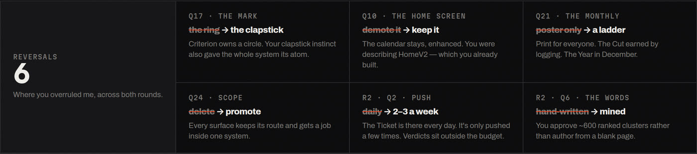
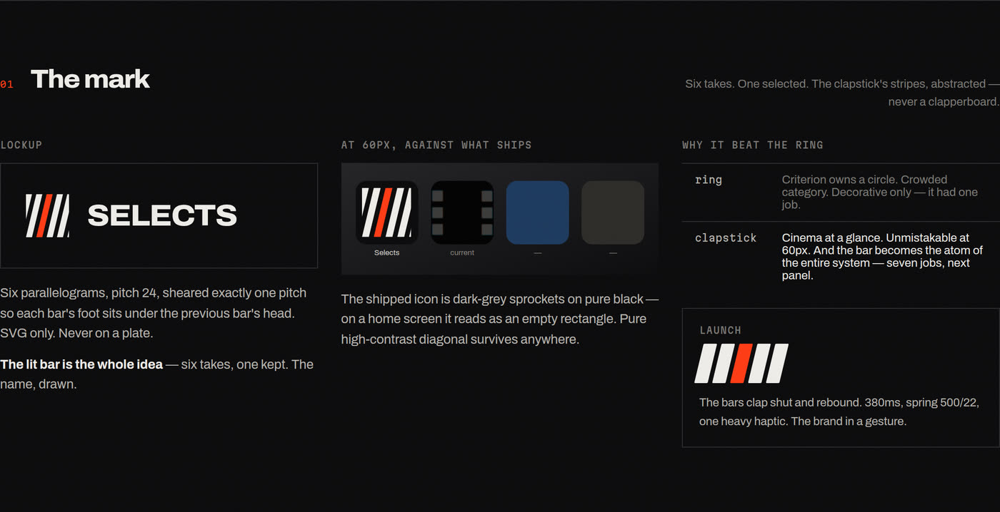
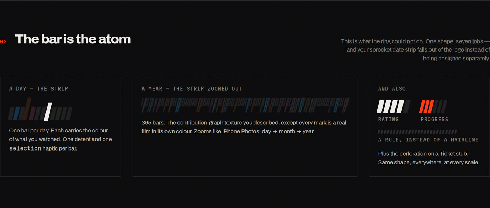
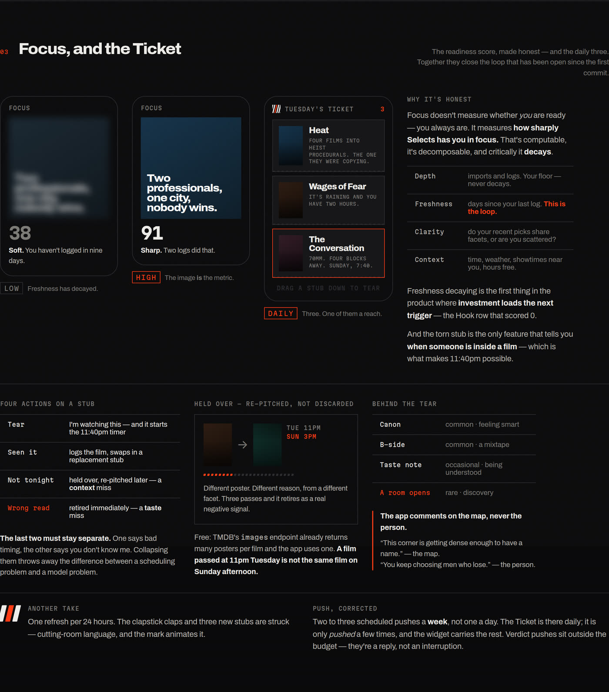
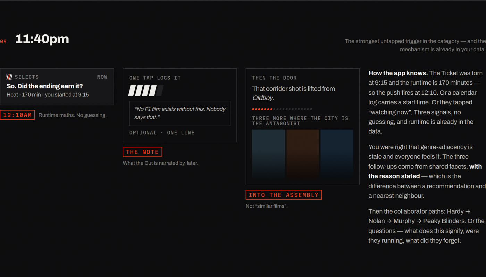
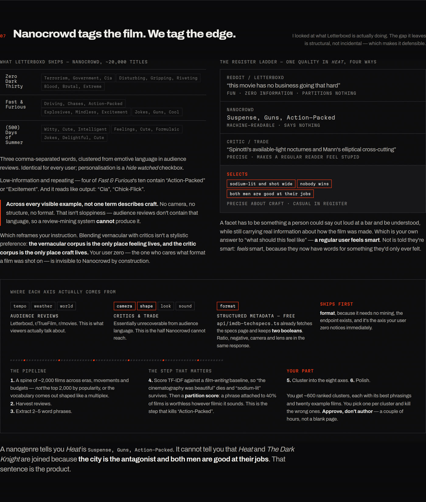
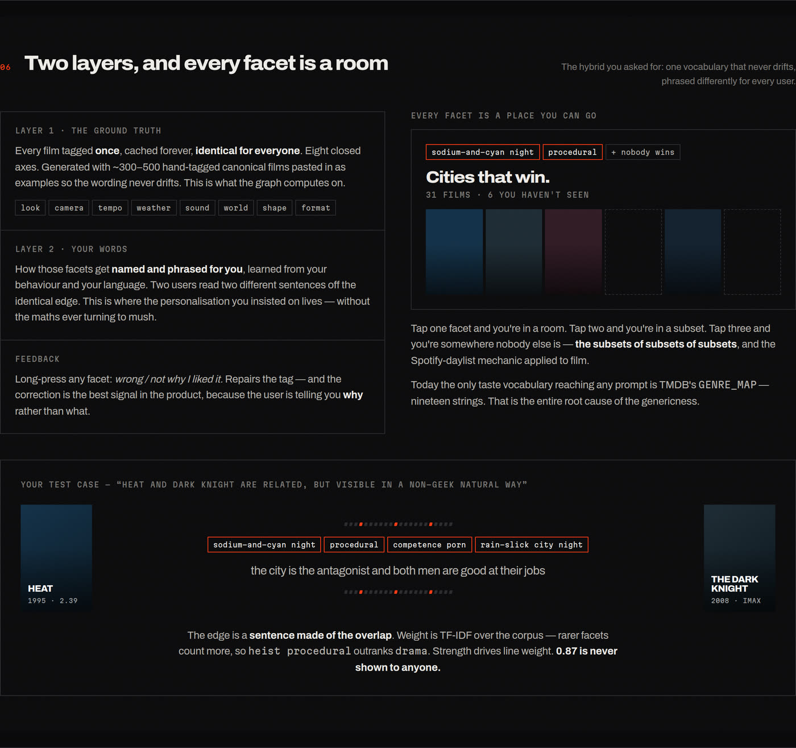
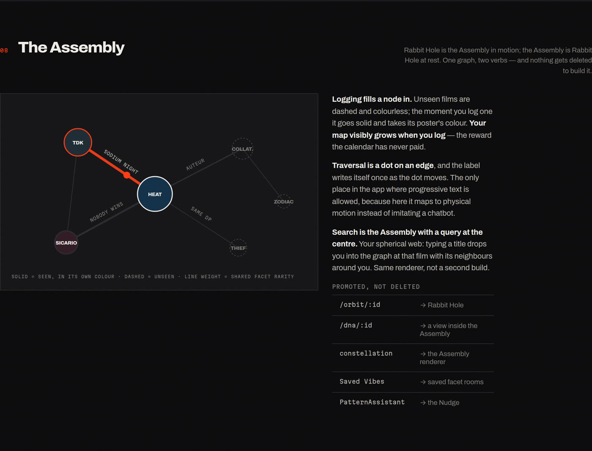
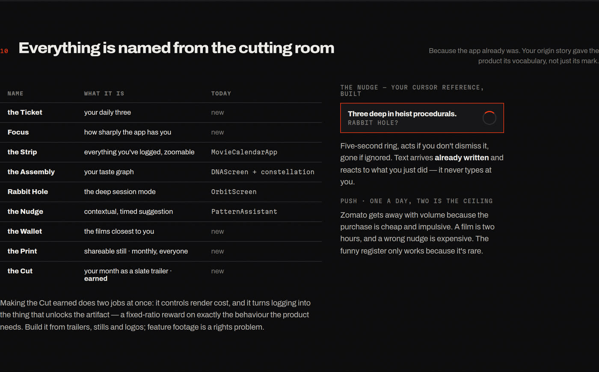

# Selects — Design Review

A full UI/UX audit of the app at `ba07af6`, your answers to all 36 questions across two rounds
converted into locked decisions, and the system that follows from them.

| Document | What it is |
|---|---|
| **[DECISIONS.md](DECISIONS.md)** | All 36 answers, locked, across both rounds. Where you overruled me, I say so. Read this first — it supersedes parts of the audit. |
| **[DIRECTION.md](DIRECTION.md)** | The system: mark, colour, type, voice, motion, and the two objects that close the loop. |
| **[VOCABULARY.md](VOCABULARY.md)** | The taste vocabulary — what Letterboxd's nanogenres actually are, where they're weak, and the mining pipeline that replaces hand-writing it. |
| **[AUDIT.md](AUDIT.md)** | The original audit. Hook Model score, feature teardown, and 38 defects with `file:line`. Findings stand; three recommendations are annotated as superseded. |
| **[QUESTIONS.md](QUESTIONS.md)** | Round 2, now answered. |
| **[direction-board.html](direction-board.html)** | The visual version. Live HTML/CSS with the fonts self-hosted — open it and edit it. |

---

## What changed

Six reversals across the two rounds, and each one made the design better.

---

## The mark

You were right about the ring: Criterion owns a circle, and a ring is not differentiating.
Your clapstick instinct is stronger — and it gave the system more than a logo.

**Six takes. One selected.** The name, drawn.

And unlike the ring, the bar is reusable. One shape, seven jobs — which means the
sprocket-detent date strip you asked for falls out of the logo instead of being designed
separately.

---

## Focus and the Ticket

Your readiness score, made honest. It doesn't measure whether *you* are ready — you always
are. It measures **how sharply Selects has you in focus**, and it **decays**.

That decay is the first thing in the product where investment loads the next trigger — the
Hook row that was scoring 0. And it's rendered as literal sharpness: the image is the metric.

The number is primary and drives the state, decay is gentle, and the stub carries four actions
— because tickets *will* surface films the user has already seen, and **Seen it** turns that
mistake into the lowest-friction logging surface in the product.

---

## 11:40pm

The mechanism was already in your data. The Ticket was torn at 9:15 and the runtime is 170
minutes, so the push fires at 12:10. No guessing — and it makes the torn stub the only feature
that tells you when someone is *inside* a film.

---

## Nanocrowd tags the film. We tag the edge.

Letterboxd's themes and nanogenres come from Nanocrowd — ~20,000 titles, three comma-separated
words, mined from audience reviews, identical for every user. Across every visible example,
**not one term describes craft**. That isn't sloppiness: audience reviews don't contain that
language, so a review-mining system can't produce it — which is why blending vernacular with
critics isn't a style preference but a data requirement.

---

## Two layers, and every facet is a room

The hybrid you asked for: one vocabulary that never drifts, phrased differently for every
user. Tap one facet and you're in a room; tap three and you're somewhere nobody else is.

---

## The Assembly

Rabbit Hole is the Assembly in motion; the Assembly is Rabbit Hole at rest. One graph, two
verbs — and nothing gets deleted to build it. Logging fills a node in, so your map visibly
grows.

---

## Named from the cutting room

Because the app already was. Your origin story gave the product its vocabulary, not just its
mark.

---

## Everything, in one image

